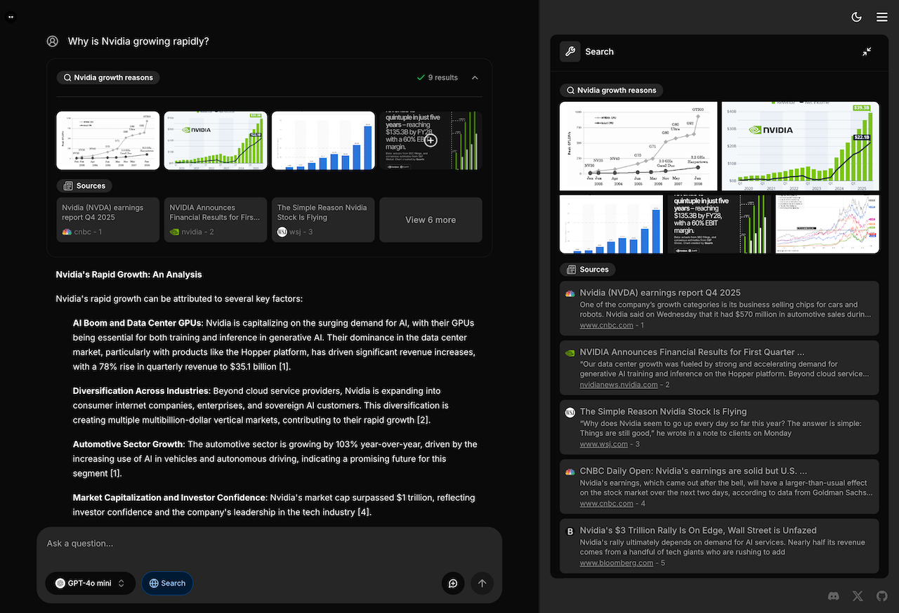

<div align="center">

# Romy

An AI-powered search engine with a generative UI.

<a href="https://vercel.com/oss">
  
</a>

<br />



</div>

## 🗂️ Overview

- 🧪 [Beta Testing](#-beta-testing)
- 🛠 [Features](#-features)
- 🧱 [Stack](#-stack)
- 🚀 [Quickstart](#-quickstart)
- 🌐 [Deploy](#-deploy)
- 🔎 [Search Engine](#-search-engine)
- 💙 [Sponsors](#-sponsors)
- 👥 [Contributing](#-contributing)
- 📄 [License](#-license)

### About v1.0.0 Branch

The `v1.0.0` branch is our pre-release branch featuring:

- Latest features and improvements
- Active bug fixes based on beta feedback
- Preparation for stable release

This branch will be merged into `main` once:

- Beta testing phase is complete
- Critical bugs are resolved
- All planned features are stable

## 🛠 Features

### Core Features

- AI-powered search with GenerativeUI
- Natural language question understanding
- Multiple search providers support (Tavily, Brave, SearXNG, Exa)
- Search modes: Quick, Planning, and Adaptive
- Model type selection: Speed vs Quality
- Inspector panel for tool execution and AI processing details

### Authentication

- User authentication powered by [Supabase Auth](https://supabase.com/docs/guides/auth)

### Chat & History

- Chat history automatically stored in PostgreSQL database
- Share search results with unique URLs
- Message feedback system
- File upload support

### AI Providers

- OpenAI (Default)
- Anthropic Claude
- Google Gemini
- Vercel AI Gateway

Models are configured in `config/models/*.json` with profile-based settings. When using non-OpenAI providers, update the model configuration files with compatible model IDs. See [Configuration Guide](docs/CONFIGURATION.md) for details.

### Search Capabilities

- URL-specific search
- Content extraction with Tavily or Jina
- Citation tracking and display
- Self-hosted search with SearXNG support

### Additional Features

- Docker deployment ready
- Browser search engine integration
- LLM observability with Langfuse (optional)
- Todo tracking for complex tasks
- Changelog system for updates

## 🧱 Stack

### Core Framework

- [Next.js](https://nextjs.org/) - React framework with App Router
- [TypeScript](https://www.typescriptlang.org/) - Type-safe development
- [Vercel AI SDK](https://sdk.vercel.ai/docs) - TypeScript toolkit for building AI-powered applications

### Authentication & Authorization (Updated Category)

- [Supabase](https://supabase.com/) - User authentication and backend services

### AI & Search

- [OpenAI](https://openai.com/) - Default AI provider (Optional: Google AI, Anthropic)
- [Tavily AI](https://tavily.com/) - AI-optimized search with context
- [Brave Search](https://brave.com/search/api/) - Traditional web search results
- Tavily alternatives:
  - [SearXNG](https://docs.searxng.org/) - Self-hosted search
  - [Exa](https://exa.ai/) - Meaning-based search powered by embeddings
  - [Firecrawl](https://firecrawl.dev/) - Web, news, and image search with crawling, scraping, LLM-ready extraction, and [open source](https://github.com/firecrawl/firecrawl).

### Data Storage

- [PostgreSQL](https://www.postgresql.org/) - Primary database (supports Neon, Supabase, or standard PostgreSQL)
- [Drizzle ORM](https://orm.drizzle.team/) - Type-safe database ORM
- [Cloudflare R2](https://developers.cloudflare.com/r2/) - File storage (optional)

### UI & Styling

- [Tailwind CSS](https://tailwindcss.com/) - Utility-first CSS framework
- [shadcn/ui](https://ui.shadcn.com/) - Re-usable components
- [Radix UI](https://www.radix-ui.com/) - Unstyled, accessible components
- [Lucide Icons](https://lucide.dev/) - Beautiful & consistent icons

## 🚀 Quickstart

### 1. Fork and Clone repo

Fork the repo to your Github account, then run the following command to clone the repo:

```bash
git clone git@github.com:[YOUR_GITHUB_ACCOUNT]/romy.git
```

### 2. Install dependencies

```bash
cd romy
bun install
```

### 3. Configure environment variables

```bash
cp .env.local.example .env.local
```

Fill in the required environment variables in `.env.local`:

```bash
# Required Configuration
DATABASE_URL=                   # PostgreSQL connection string
OPENAI_API_KEY=                 # Get from https://platform.openai.com/api-keys
TAVILY_API_KEY=                 # Get from https://app.tavily.com/home
BRAVE_SEARCH_API_KEY=           # Get from https://brave.com/search/api/
NEXT_PUBLIC_SUPABASE_URL=       # Your Supabase project URL
NEXT_PUBLIC_SUPABASE_ANON_KEY=  # Your Supabase anonymous key
```

For optional features configuration (SearXNG, alternative AI providers, etc.), see [CONFIGURATION.md](./docs/CONFIGURATION.md)

### 4. Run database migrations

```bash
bun run migrate
```

This command will create the necessary database tables.

### 5. Run app locally

#### Using Bun

```bash
bun dev
```

#### Using Docker

```bash
docker compose up -d
```

Visit http://localhost:3000 in your browser.